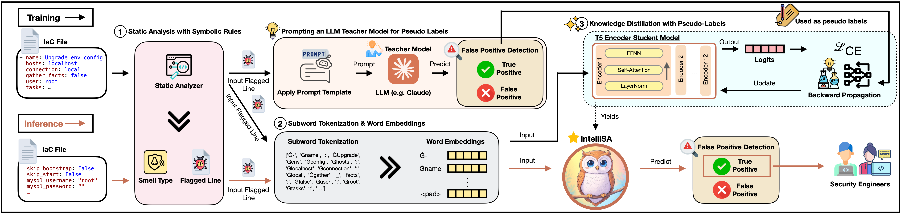

# IntelliSA

<p align="center">
  
</p>

> An Intelligent Analyzer for IaC Security Smell Detection via Rule and Neural Inference

**Paper**: "IntelliSA: An Intelligent Analyzer for IaC Security Smell Detection via Rule and Neural Inference"

<p align="center">
  
</p>

## Overview

**Problem**: Static analysis tools generate high false positive rates, causing alert fatigue.

**Solution**: IntelliSA combines rule-based detection with neural inference to filter false positives while maintaining high recall.

**Target**: 9 security smell categories across Ansible, Chef, and Puppet.

### Key Results

<p align="center">
  
</p>

## Artifact Scope

- Reproduce Tables 2–6 via `replication/RQ*/run_rq*.sh` (RQ1–RQ3).
- Run the IntelliSA CLI on the oracle dataset to see end-to-end behavior.
- Optional internals (for curiosity only): early experiments and training pipeline are linked below.

## DataSets

See [`replication/datasets/README.md`](replication/datasets/README.md) for details on the oracle and training datasets.

See [`replication/prompts/README.md`](replication/prompts/README.md) for all prompt templates used in experiments.

## Repositories

### IntelliSA-CLI

Production-ready CLI tool implementing the IntelliSA method.

**GitHub**: [intellisa-cli](https://github.com/ndryzsfdkx-source/anon-cli)

### Optional internals

- [anon-experiments](../anon-experiments): Early GLITCH analysis, LLM prompting trials, and pseudo-label generation scripts.
- [anon-models](../anon-models): Full student-model training and distillation pipeline used to produce the CLI’s postfilter model.

## Data & Replication

- Everything to rerun Tables 2–6 and grab datasets: see `replication/` (details in `replication/README.md`).

## Artifact Reproducibility

See `artifact/release-manifest.yaml` for pinned commit SHAs, model versions, dataset versions, and tool dependencies used to generate paper results.

## License

Research code: Apache 2.0 (see individual repo licenses)

## Citation

```bibtex
PLACEHOLDER
```
